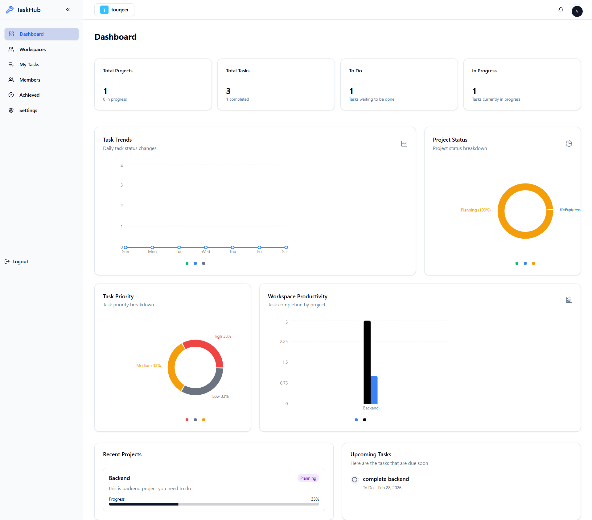
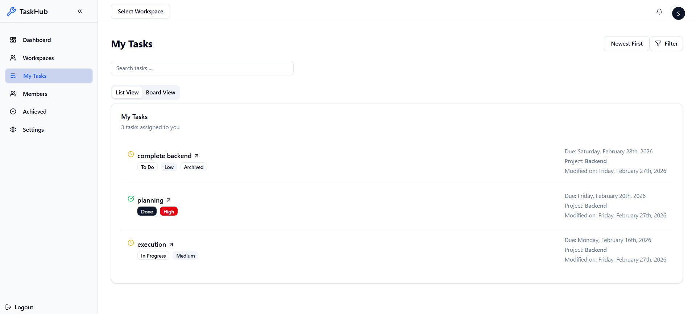
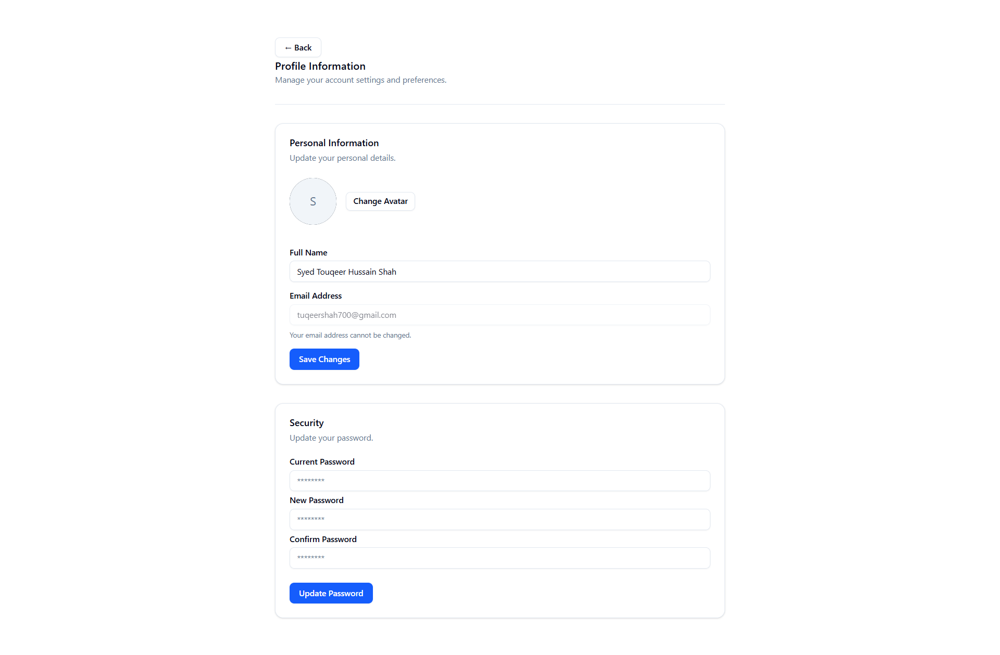
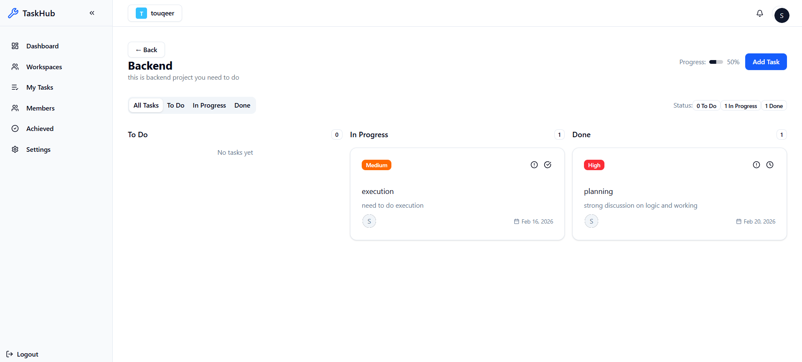

# TaskHub 🚀


[](https://reactjs.org/)
[](https://www.typescriptlang.org/)
[](https://nodejs.org/)
[](https://expressjs.com/)
[](https://www.mongodb.com/)

TaskHub is a professional task management platform designed to streamline team collaboration, project tracking, and task organization. It offers modern UI, real-time dashboards, workspace/project management, and secure authentication.

---

## Table of Contents
- [Features](#features)
- [Tech Stack](#tech-stack)
- [App Structure](#app-structure)
- [Getting Started](#getting-started)
- [Folder Structure](#folder-structure)
- [Screenshots](#screenshots)
- [Contributing](#contributing)
- [License](#license)
- [Contact](#contact)

---

## Features
- User authentication with JWT
- Workspaces & project management
- Task creation, assignment, and tracking
- Comment section & sub-task handling
- Dashboard with charts & statistics
- Real-time UI updates with React Query
- Form validation using Zod
- Responsive and accessible UI with Tailwind CSS & shadcn/ui

---

## Tech Stack

**Frontend:**
- React + TypeScript
- React Router 7
- React Query
- Tailwind CSS 4 + shadcn/ui
- Lucide-react icons, Recharts for charts
- Axios, React Hook Form, Zod

**Backend:**
- Node.js + Express
- MongoDB with Mongoose
- JWT Authentication & Bcrypt password hashing
- Zod validation middleware
- CORS, Morgan for logging
- SendGrid for email notifications
- Arcjet for security/rate-limiting checks

---

## App Structure

**Frontend**
- `root.tsx` - App shell & providers
- `routes.ts` - All routes
- `auth-context.tsx` - Auth state & login/logout
- `react-query-provider.tsx` - React Query provider
- `hooks/*` - Custom API hooks
- `components/*` - UI components (Dashboard, Task, Workspace, Shared)

**Backend**
- `index.js` - Server entry, middleware, DB connection
- `routes/*` - API routes
- `controllers/*` - Request handlers
- `models/*` - MongoDB schemas
- `middleware/*` - Auth & validation
- `utils/*` - Utilities (email, validation, security)

-----------------------------------------------------------------------------------------------------
## ScreenShots






## Getting Started

### Prerequisites
- Node.js >= 18
- MongoDB instance
- npm or yarn

### Installation

```bash
# Clone the repo
git clone https://github.com/<your-username>/TaskHub.git
cd TaskHub

# Install backend dependencies
cd backend
npm install

# Install frontend dependencies
cd ../frontend
npm install

# Welcome to React Router!

A modern, production-ready template for building full-stack React applications using React Router.

[](https://stackblitz.com/github/remix-run/react-router-templates/tree/main/default)

## Features

- 🚀 Server-side rendering
- ⚡️ Hot Module Replacement (HMR)
- 📦 Asset bundling and optimization
- 🔄 Data loading and mutations
- 🔒 TypeScript by default
- 🎉 TailwindCSS for styling
- 📖 [React Router docs](https://reactrouter.com/)

## Getting Started

### Installation

Install the dependencies:

```bash
npm install
```

### Development

Start the development server with HMR:

```bash
npm run dev
```

Your application will be available at `http://localhost:5173`.

## Building for Production

Create a production build:

```bash
npm run build
```

## Deployment

### Docker Deployment

To build and run using Docker:

```bash
docker build -t my-app .

# Run the container
docker run -p 3000:3000 my-app
```

The containerized application can be deployed to any platform that supports Docker, including:

- AWS ECS
- Google Cloud Run
- Azure Container Apps
- Digital Ocean App Platform
- Fly.io
- Railway

### DIY Deployment

If you're familiar with deploying Node applications, the built-in app server is production-ready.

Make sure to deploy the output of `npm run build`

```
├── package.json
├── package-lock.json (or pnpm-lock.yaml, or bun.lockb)
├── build/
│   ├── client/    # Static assets
│   └── server/    # Server-side code
```

## Styling

This template comes with [Tailwind CSS](https://tailwindcss.com/) already configured for a simple default starting experience. You can use whatever CSS framework you prefer.

---

Built with ❤️ using React Router.
